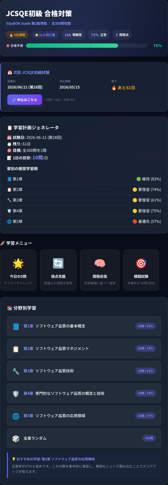
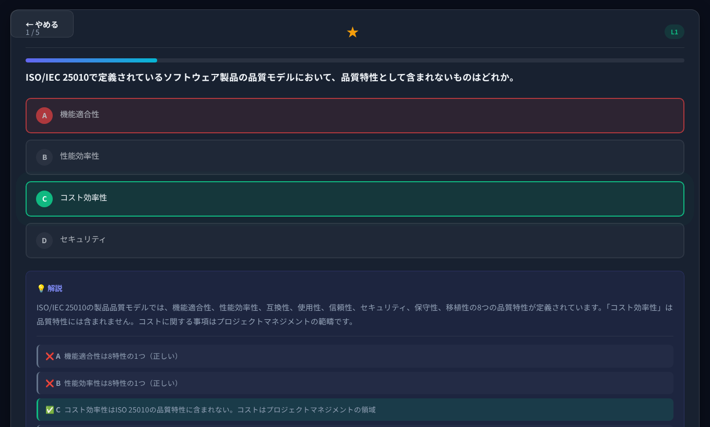
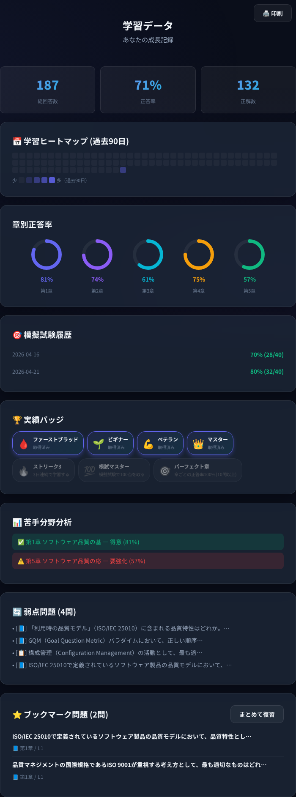
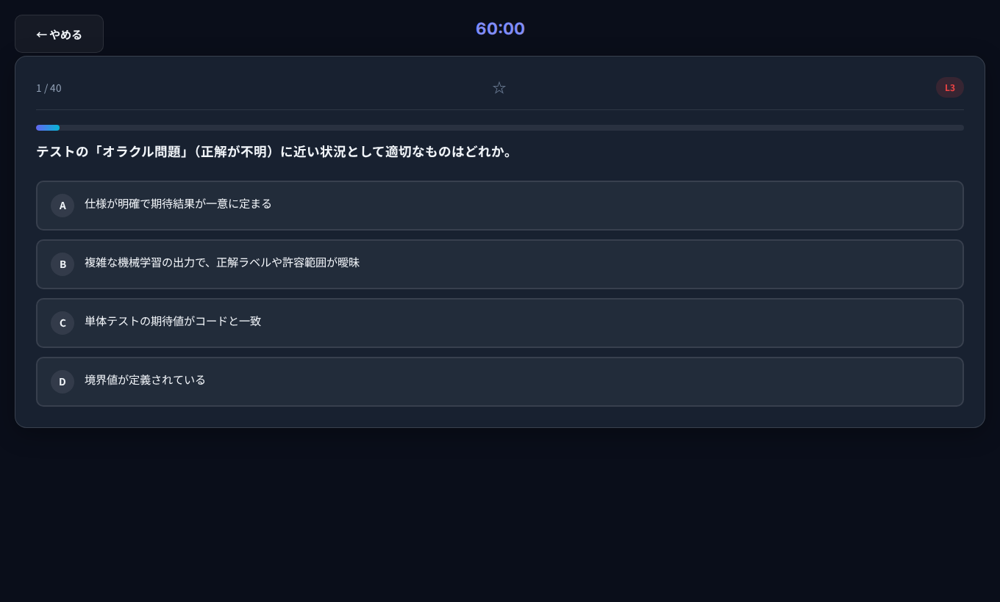

# 🎓 JCSQE初級 合格対策学習アプリ

[](LICENSE)
[](https://jcsqe-study-app.pages.dev)
[](https://jcsqe-study-app-staging.pages.dev)
[]()

<p align="center">
  
</p>

> **SQuBOK Guide 第3版**に準拠した、JCSQE初級（ソフトウェア品質技術者資格試験）合格を目指す実践型学習Webアプリです。  
> **デモ:** [本番](https://jcsqe-study-app.pages.dev) · [検証](https://jcsqe-study-app-staging.pages.dev)

### 学習の流れ（概要）

<p align="center">
  
</p>

### スクリーンショット（実画面）

<p align="center">
  <br />
  <sub>ホーム — 300問収録・デイリーや模試への導線</sub>
</p>

<p align="center">
  <br />
  <sub>出題と解答後の選択肢別解説（SQuBOK 参照付き）</sub>
</p>

<p align="center">
  <br />
  <sub>成績 — 章別正答率・ヒートマップ・弱点・バッジ</sub>
</p>

<p align="center">
  <br />
  <sub>模擬試験 — 本番形式（40問 / 60分）</sub>
</p>

キャプチャの差し替え手順は [docs/images/readme/README.md](docs/images/readme/README.md)（`npm run screenshots:readme`）。

---

## ✨ 特徴

| 機能 | 説明 |
|------|------|
| 📚 **分野別学習** | SQuBOK全5章から章ごとに問題を出題。即座に解説を表示 |
| 🔄 **弱点克服** | 間違えた問題を自動記録し、優先的に出題。正解すると弱点リストから除外 |
| 🎯 **模擬試験** | 本番と同じ40問・60分のタイマー付き模擬試験 |
| 📊 **成績ダッシュボード** | 章別正答率・学習進捗・弱点一覧を可視化 |
| 💡 **選択肢別解説** | 各問題の正解理由・不正解理由をSQuBOK参照付きで詳細解説 |

## 📖 対応範囲（SQuBOK Guide 第3版）

| 章 | テーマ | 問題数 |
|----|--------|--------|
| 第1章 | ソフトウェア品質の基本概念 | 60問 |
| 第2章 | ソフトウェア品質マネジメント | 60問 |
| 第3章 | ソフトウェア品質技術 | 60問 |
| 第4章 | 専門的なソフトウェア品質の概念と技術 | 60問 |
| 第5章 | ソフトウェア品質の応用領域 | 60問 |

## 🚀 使い方

### オンライン

**Cloudflare Pages（`*.pages.dev`）** — [ut-qms](https://github.com/junichi-muraoka/ut-qms) と同様に本番・検証でプロジェクトを分け、GitHub Actions からデプロイする。**本番は GitHub Release を公開したとき**（`master` の push だけでは本番は更新されない）。検証は **`staging` / `develop` への push**。

| 環境 | URL（デフォルトのプロジェクト名） | 更新のしかた（概要） |
|------|-----------------------------------|----------------------|
| **本番（PRD）** | [jcsqe-study-app.pages.dev](https://jcsqe-study-app.pages.dev) | **Release を Publish**（タグ `v…`）。緊急時は Actions から `master` で手動実行も可 |
| **検証（STG）** | [jcsqe-study-app-staging.pages.dev](https://jcsqe-study-app-staging.pages.dev) | **`staging` / `develop` に push** |

デプロイの仕組み・Secrets は [docs/environments.md](docs/environments.md)。**Cloudflare Pages の初回セットアップ**は [docs/cloudflare_pages_setup.md](docs/cloudflare_pages_setup.md)。

ブラウザでアクセスするだけですぐに学習を開始できます。

### ローカル
```bash
git clone https://github.com/junichi-muraoka/jcsqe-study-app.git
cd jcsqe-study-app
npm test
# 方法1: ブラウザで直接開く
open index.html

# 方法2: ローカルサーバーで起動
npx http-server ./ -p 8080 -o
```

## 🛠️ 技術スタック

- **HTML5** — セマンティック構造
- **CSS3** — ダークモード・グラスモーフィズムデザイン
- **Vanilla JavaScript** — フレームワーク不使用、軽量動作
- **localStorage** — 学習データの永続化（サーバー不要）
- **Firebase（任意）** — Google ログインと Firestore への学習データ同期。[`js/firebase-config.js`](js/firebase-config.js) に Firebase コンソールの Web 設定を入れると有効（未設定でも従来どおりオフライン動作）

### Firebase を有効にする手順（概要）

1. [Firebase Console](https://console.firebase.google.com/) でプロジェクトを作成し、**Authentication（Google）** と **Cloud Firestore** を有効化する。
2. プロジェクト設定から Web アプリ用の **`firebaseConfig`** をコピーする。ローカルでは [`js/firebase-config.example.js`](js/firebase-config.example.js) を元に `js/firebase-config.js` を作る。**GitHub 上の本番・STG** では Repository secret **`FIREBASE_WEB_CONFIG_JSON`**（1 行 JSON）を設定し、デプロイ時に注入する（リポジトリに実キーをコミットしない）。
3. `firestore.rules` をデプロイする（`firebase deploy --only firestore:rules`、コンソール貼り付け、または GitHub Actions の **Firestore rules** ワークフローで自動。要 `FIREBASE_TOKEN` 等。詳細は [docs/firebase_manual_setup.md](docs/firebase_manual_setup.md)）。
4. 認証ドメインに **Cloudflare Pages** の各 `*.pages.dev` ホスト（本番・検証でホストが別）を **承認済みドメイン**に追加する。手順は [docs/firebase_manual_setup.md](docs/firebase_manual_setup.md)。旧 **GitHub Pages** の URL も使う場合は `user.github.io` も追加する。

**画面操作を順番に追う手順**は [docs/firebase_manual_setup.md](docs/firebase_manual_setup.md) を参照。仕様・エラー UX は [docs/09_cloud_sync_firebase_spec.md](docs/09_cloud_sync_firebase_spec.md)。

## 📝 JCSQE試験について

| 項目 | 内容 |
|------|------|
| 正式名称 | ソフトウェア品質技術者資格認定（初級） |
| 主催 | 日本科学技術連盟（JUSE） |
| 出題数 | 40問（4択） |
| 試験時間 | 60分 |
| 合格ライン | 約70%（28問正解） |
| 出題範囲 | SQuBOK Guide 第3版 |
| 知識レベル | L1（知っている）〜 L3（概念と使い方がわかる） |

**公式情報・本アプリの位置づけ**（過去問ではないこと・リンク集）は [docs/exam_meta.md](docs/exam_meta.md) を参照。

## 🤝 コントリビューション

問題の追加・修正、機能改善のプルリクエストを歓迎します！

詳しくは [CONTRIBUTING.md](CONTRIBUTING.md) をご覧ください。

## 📚 ドキュメント (Documentation)

開発者向けの技術的な仕様や将来のロードマップについては、`docs/` フォルダ内の以下のドキュメントを参照してください。

- [システムアーキテクチャ (01_architecture.md)](docs/01_architecture.md)
- [データモデル・保存仕様 (02_data_model.md)](docs/02_data_model.md)
- [機能仕様書 (03_features.md)](docs/03_features.md)
- [UI設計・デザイン仕様 (04_ui_design.md)](docs/04_ui_design.md)
- [将来の拡張ロードマップ (05_future_roadmap.md)](docs/05_future_roadmap.md)
- [開発・ドキュメント管理ワークフロー (06_development_workflow.md)](docs/06_development_workflow.md)（CI・**本番/検証デプロイ**）
- [クラウド同期・Firebase 制限とエラー UX (09_cloud_sync_firebase_spec.md)](docs/09_cloud_sync_firebase_spec.md)
- [Firebase 手動セットアップ手順（コンソール・CLI）(firebase_manual_setup.md)](docs/firebase_manual_setup.md)
- [実行環境一覧（本番・検証・Firebase）(environments.md)](docs/environments.md)
- [インフラ・運用の見直しガイド（棚卸し・チェックリスト）(infrastructure_review.md)](docs/infrastructure_review.md)
- [運用 Runbook（デプロイ・障害時）(runbook.md)](docs/runbook.md)
- [コンテンツ編集ガイド（問題・解説）(content_authoring.md)](docs/content_authoring.md)
- [リリース運用（バージョン・CHANGELOG）(release_process.md)](docs/release_process.md)
- [セキュリティ・プライバシー概要 (security.md)](docs/security.md)
- [試験メタ・公式ソース (exam_meta.md)](docs/exam_meta.md)
- [アクセシビリティ方針 (accessibility.md)](docs/accessibility.md)

## 📄 ライセンス

[MIT License](LICENSE) © 2026 junichi-muraoka

## ⚠️ 免責事項

本アプリは試験対策の学習支援を目的として作成されたものです。収録問題は公式の過去問ではなく、SQuBOK Guide 第3版の内容に基づいて独自に作成したものです。試験の合格を保証するものではありません。
