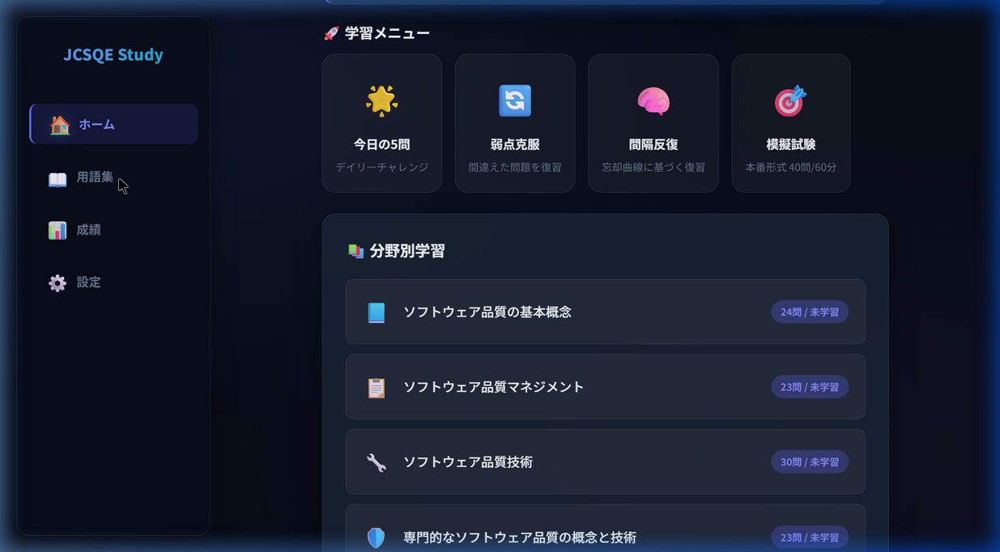
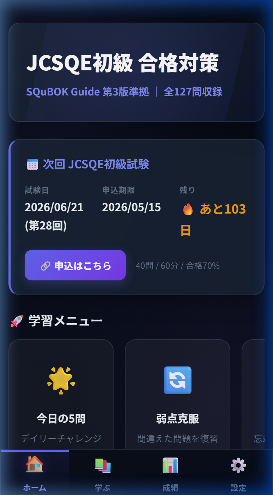

# UI設計・デザイン仕様 (UI Design)

本アプリ（UI v3以降）のUI設計の基本方針、カラーパレット、スタイリングのルールを定義します。

## 1. 基本コンセプト
「のっぺり感」を排除し、**「立体的でモダンなダークテーマ・グラスモーフィズム」**を基調とした、操作していて心地よいUIを目指します。

## 2. カラーパレット (CSS Variables)

`style.css` の `:root` で定義されている主なカラー変数は以下の通りです。

```css
:root {
  --bg-dark: #0f172a;       /* メイン背景色（深い紺） */
  --bg-panel: #1e293b;      /* パネル背景色 */
  --bg-glass: rgba(30, 41, 59, 0.7); /* グラスモーフィズム（半透明）背景 */
  
  --text-primary: #f8fafc;  /* メインテキスト（白） */
  --text-secondary: #cbd5e1;/* サブテキスト（薄いグレー） */
  --text-muted: #64748b;    /* 目立たないテキスト */
  
  --accent-base: #6366f1;   /* メインアクセントカラー（インディゴ） */
  --accent-light: #818cf8;  /* アクセント（明るめ） */
  --accent-glow: rgba(99,102,241,0.5); /* グロー用のシャドウ色 */

  --border-glass: rgba(255, 255, 255, 0.1); /* ガラス境界線 */
  
  /* レスポンシブ用変数 */
  --sidebar-width: 240px;   /* PC表示時の左サイドバー幅 */
  --bottom-nav-height: 64px;/* スマホ表示時の下部ナビ高さ */
}
```

## 3. レスポンシブレイアウト基盤

画面幅によるメディアクエリ（Breakpoint: `768px`）を用いて、ナビゲーションの配置を動的に変更します。

### PCレイアウト (`min-width: 768px`)
- `<nav class="app-nav">` を画面左側に固定（`position: fixed`）し、`width: var(--sidebar-width)` として「**左サイドバー**」として運用します。
- メインコンテンツ（`.content-wrapper`）には `margin-left: var(--sidebar-width)` を与えて隙間を確保します。

### スマホレイアウト (`max-width: 767px`)
- サイドバーのスタイルをリセットし、`bottom: 0`, `width: 100%`, `height: var(--bottom-nav-height)` を設定して「**ボトムナビゲーション**」として画面下部に固定します。
- 各アイコンは等間隔に配置（`justify-content: space-around`）し、指でタップしやすいサイズ（最小44x44px相当）を確保します。

### フルスクリーンオーバーレイ（クイズ・結果画面）
- `#quiz` と `#result` は `body` の直下に配置し、`.full-screen` クラスで `position: fixed`、`z-index: 200000` を指定。サイドバー（`z-index: 99999`）より上に重なるため、デスクトップ幅でも問題文・選択肢が隠れず表示される。

## 4. UIコンポーネントのルール

- **カード (`.card`, `.nav-card`)**: 背景は半透明（`--bg-glass`）とし、薄いボーダー（`--border-glass`）とドロップシャドウをかけることで、背景から少し浮き上がった「グラスモーフィズム」風に仕上げる。
- **ボタン (`.btn`, `.choice-btn`)**: ホバー時やタップ時に少し上に浮き上がるアニメーション（`transform: translateY(-2px)`）を適用し、インタラクティビティを強調する。
- **アニメーション (`.flash`, `.shake`)**: クイズの正解時には緑色に明滅（フラッシュ）、不正解時にはブルブル震える（シェイク）アニメーションクラスを付与し、視覚的なフィードバックを即座に返す。
- **ヒーローエリア (`.hero-section`)**: ホーム画面上部にはグラデーション背景を適用し、アプリアイデンティティと最重要情報（合否予測や試験日）を強調表示する。

## 5. 画面レイアウトの具体例（スクリーンショット）

構築したレスポンシブデザインの実際の表示レイアウトは以下の通りです。

### デスクトップ表示（サイドバー）
広々とした領域を活かし、左サイドバーにメインメニューを常時表示します。


### モバイル表示（ボトムナビゲーション）
スマートフォンの縦長画面に最適化し、下部にボトムナビゲーションを配置します。横スクロールメニューもシームレスに動作します。

