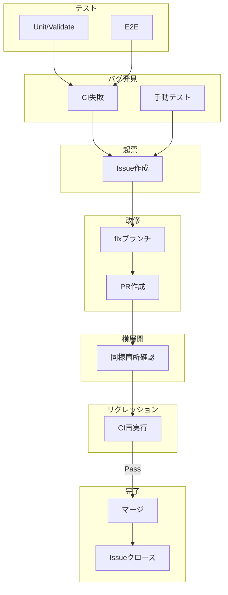

# 開発・ドキュメント管理ワークフロー (Development Workflow)

本プロジェクトでは、持続可能な開発とドキュメントの鮮度を保つために、**GitHub Actions (CI)** と **AIエージェント** を組み合わせた自動化ワークフローを導入しています。

## 1. ドキュメント更新忘れ防止CI (GitHub Actions)

アプリケーションの仕様を変えたにも関わらず、設計書や仕様書の更新が追いついていない「ドキュメントの陳腐化」を防ぎます。

- **ファイル**: `.github/workflows/docs_check.yml`
- **トリガー**: `master` ブランチに対する Pull Request の作成・更新時
- **仕組み**:
  1. `app.js` や `index.html`, `style.css` などのアプリ本体コードに変更があったかを検知。
  2. 同時に `docs/` ディレクトリ内や `README.md` に変更があったかを検知。
  3. **「コードが変更されたのに、ドキュメントが一切変更されていない」** 場合、CIが「エラー（❌）」となり、Pull Request のマージをブロック（または警告）します。

## 2. テストCI (GitHub Actions)

軽量な回帰テストを `node:test` で実行し、データ移行やインポート検証など壊れやすいロジックの退行を防ぎます。

- **ファイル**: `.github/workflows/test.yml`
- **トリガー**: `master` への push / Pull Request
- **実行内容**:
  1. Node.js 22 をセットアップ
  2. `npm test` を実行
  3. `tests/` 配下のテストをまとめて検証

ローカルでも以下で同じテストを実行できます。

```bash
npm test
```

## 3. AIエージェントによる自動ドキュメント更新

CIが落とされた（あるいは更新が必要だと気付いた）場合、人間が手動でドキュメントを直す手間を省くため、AIアシスタント（Antigravity等）に更新を代行させるためのカスタム手順書を用意しています。

- **ファイル**: `.agents/workflows/update_docs.md`
- **特徴**: リポジトリ内にAI専用の「指示書（プロンプト）」を配置しておくことで、AIが現在のプロジェクトの文脈や差分を正確に読み取り、自律的にドキュメントを更新します。
- **使い方**:
  開発・改修作業が一段落したタイミングで、AIチャット画面にて以下のように指示を出します。
  > `/update_docs ワークフローを実行して`
  > （または：「最新のコミット差分を見て、docs/ 内のドキュメントを最新化してコミットして」）

  すると、AIが以下のステップを自動実行します。
  1. `git diff` で直近のコード変更箇所を特定。
  2. `01` から `05` までの各ドキュメント（アーキテクチャ、データモデル、機能仕様など）を読み込み、影響範囲を推論。
  3. 必要なファイル群を自動で編集・上書き。
  4. 変更を `git commit` し、ドキュメント更新を完了させる。

## 4. データ整合性チェック（問題・解説）

問題データ（`questions*.js`）と解説データ（`explanations.js` / `explanations_exp3.js`）の整合性を PR 時に自動検証します。

- **ファイル**: `.github/workflows/validate_questions.yml`
- **トリガー**: `questions*.js` または `explanations.js` / `explanations_exp3.js` が変更された PR
- **スクリプト**: `scripts/validate-questions.js`

詳細な計画は [07_automated_testing_plan.md](07_automated_testing_plan.md) を参照してください。

## 5. バグ改修フロー

バグ発見時は Issue を作成し、改修完了後には原因・対策・再発防止を記録して横展開に活かします。

- **Issue テンプレート**: `.github/ISSUE_TEMPLATE/bug_report.md`
- **報告時（発見者が記入）**: 現象、再現手順、期待値、実際の動作、発生環境、発生条件、重大度、影響範囲、回避策、添付
- **修正後（修正者が記入）**: 原因、対策、検証方法、横展開、再発防止、関連PR

**運用ルール**:
1. バグ発見 → Issue 作成（報告時セクションを記入）
2. 修正 PR 作成 → 関連 Issue をリンク
3. **PR マージ前に** 該当 Issue の「修正後」セクションを記入
4. マージ後、Issue をクローズ

## 6. バグ改修 CI/CD フロー

テスト → バグ発見 → 起票 → 改修 → 横展開 → リグレッション → 完了の一連の流れを CI/CD で担保します。



### 各ステップの説明

| ステップ | 内容 |
|----------|------|
| **テスト** | L1: `npm test`（unit + validate）、L2: Playwright E2E（app 変更時） |
| **バグ発見** | CI 失敗、または手動テストで不具合を検知 |
| **起票** | Issue を作成し、報告時セクションを記入。main への push でテスト失敗時は自動で Issue が作成される |
| **改修** | fix ブランチで修正し、PR を作成 |
| **横展開** | 同様の実装箇所がないか確認し、必要に応じて修正 |
| **リグレッション** | PR に push するたびに CI が再実行。全テスト通過でリグレッションなしとみなす |
| **完了** | マージ後、`Closes #N` で Issue が自動クローズ |

### 自動 vs 手動 起票フロー

| 発見経路 | 起票方法 | トリガー |
|----------|----------|----------|
| **main への push で npm test 失敗** | 自動 | `test.yml` の `create-regression-issue` |
| **main への push で E2E 失敗** | 自動 | `e2e.yml` の `create-regression-issue` |
| **PR で test/E2E 失敗** | 手動 | 開発者が対応（修正中とみなす） |
| **手動テストで発見** | 手動 | `npm run bug:sync`（issues/*.md 一括）または `npm run bug:report` |

### main への push 失敗時の自動 Issue 作成

`master` ブランチへの直接 push でテストが失敗した場合、リグレッション検知のため自動で Issue が作成されます。

| ワークフロー | 対象 | タイトル例 |
|-------------|------|------------|
| `test.yml` | `npm test` 失敗 | `[Regression] Tests failed on main @ abc1234` |
| `e2e.yml` | E2E 失敗 | `[Regression] E2E tests failed on main @ abc1234` |

- **本文**: 失敗したコミット、ワークフロー実行ログへのリンク、修正後セクションのひな形
- **トリガー**: `push` のみ。PR 上の失敗では作成されません（修正中とみなす）
- **E2E の実行**: `push` と `pull_request` の両方で、app ファイル変更時に実行

### 手動起票の簡略化

手動テストでバグを発見した場合、以下で素早く Issue を作成できます。

```bash
# issues/bug-*.md を GitHub Issue に一括同期（推奨）
npm run bug:sync

# テンプレート本文をプリフィルして新規 Issue 作成
npm run bug:report

# ブラウザで New Issue を開く
npm run bug:report:web
```

**`bug:sync`**: `issues/` フォルダ内の `bug-*.md` を走査し、未起票のものを `gh issue create` で一括作成します。`issues/.synced.json` で起票済みを管理するため、二重起票は発生しません。`gh auth login` 済みである必要があります。

**`bug:report`**: 実行後、タイトルを入力するよう促されます。`[Bug] 現象の概要` のように記入してください。

### Branch Protection の推奨設定

main の品質を守るため、以下を推奨します。

- **Require a pull request before merging**: 有効化
- **Require status checks to pass**: 有効化し、`test` を必須に
- **Do not allow bypassing the above settings**: 管理者も含めて適用（任意）

詳細は [CONTRIBUTING.md](../CONTRIBUTING.md) を参照してください。

## 7. E2E テスト（Playwright）

PR でアプリ本体が変更されたとき、Playwright による E2E テストが自動実行されます。

- **ファイル**: `.github/workflows/e2e.yml`
- **テスト**: `tests/e2e.spec.js`
- **Playwright MCP との連携**: [08_hybrid_testing_strategy.md](08_hybrid_testing_strategy.md) にハイブリッド構成案を記載

## 8. Issue 作成時のバリデーション

Issue 作成・編集時に、テンプレートの必須項目が埋まっているか自動チェックします。

- **ファイル**: `.github/workflows/validate_issue.yml`
- **スクリプト**: `scripts/validate-issue.js`
- **対象**: [Bug] 再現手順・環境、[Question] 対象の章、[Feature] 提案内容

## 9. まとめ：理想的な開発サイクル

1. **開発**: 開発者がコードを書き、新しい機能を追加する。
2. **AI更新**: AIに `/update_docs` を指示し、ドキュメントの追従を任せる。
3. **テスト実行**: `npm test` と GitHub Actions で回帰がないことを確認する。
4. **（任意）テスト生成**: Playwright MCP で AI にテストコード生成を依頼し、`tests/` に追加。
5. **PR作成**: GitHubにプッシュしPull Requestを作成する。
6. **CI通過**: GitHub Actions がテストとドキュメント更新を確認し、グリーン（✅）になる。
7. **マージ**: 安心して `master` へ取り込む。

この仕組みにより、開発スピードを落とさずに常に最新の設計書・仕様書を維持することができます。
