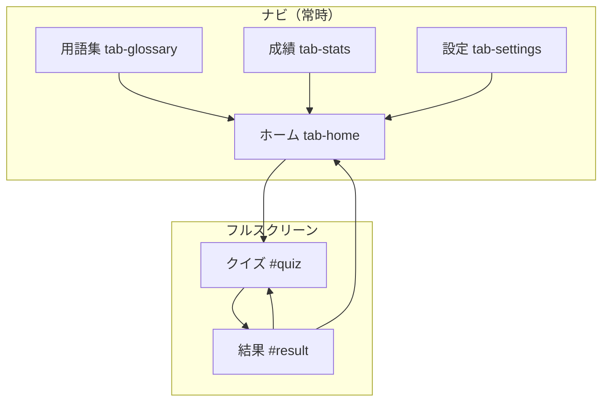
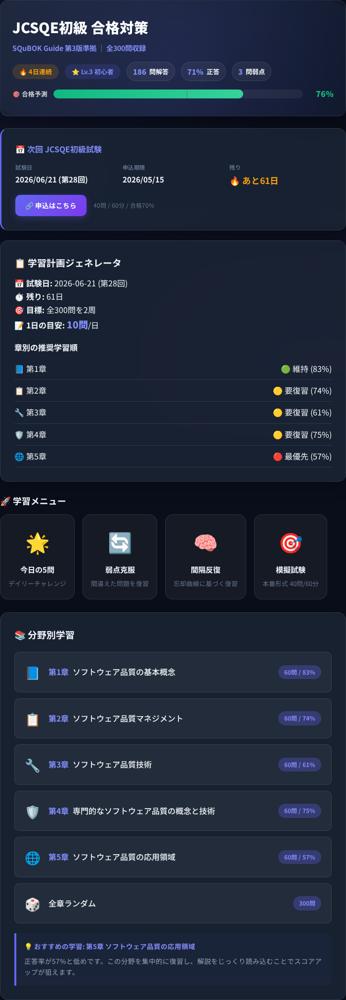
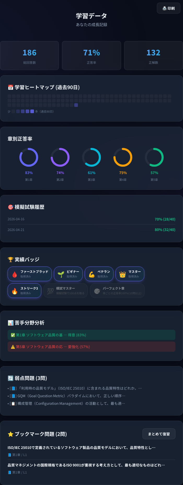
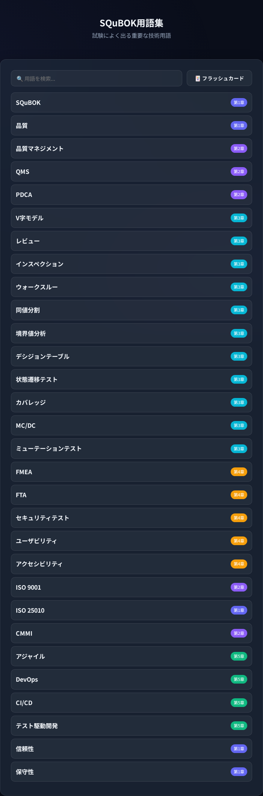
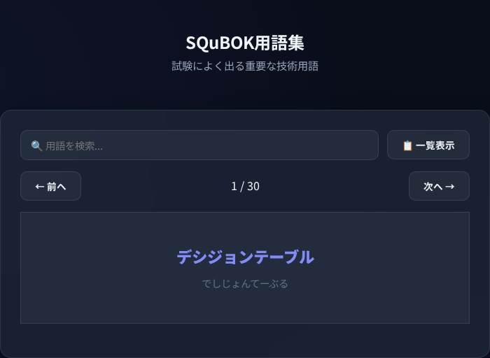
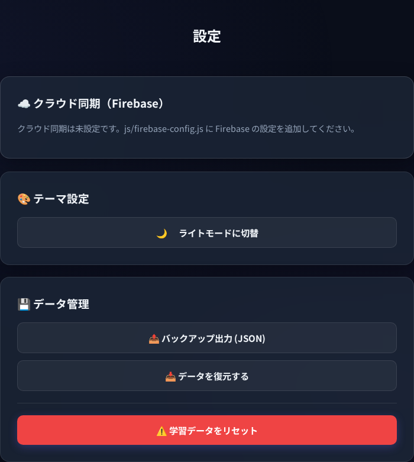
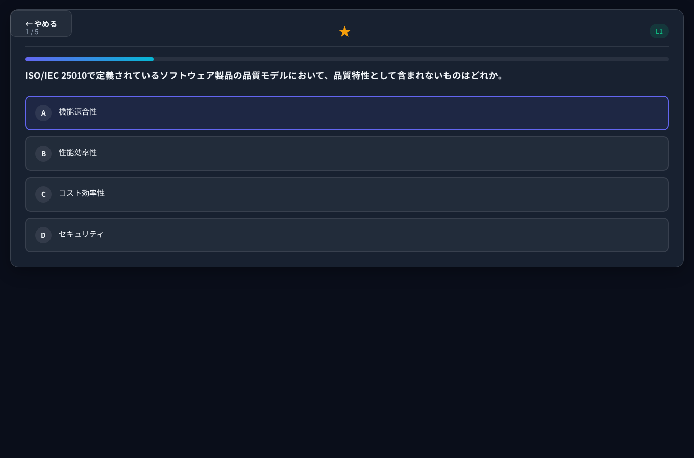
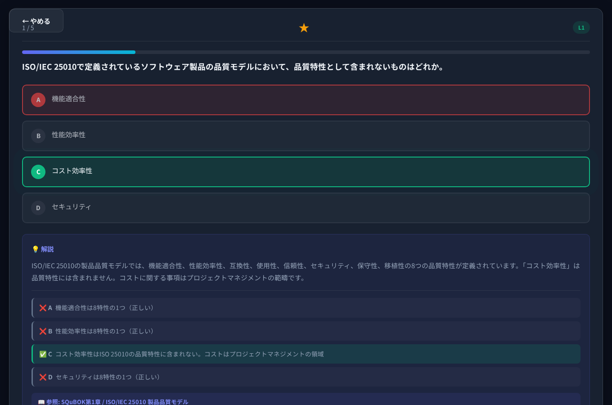
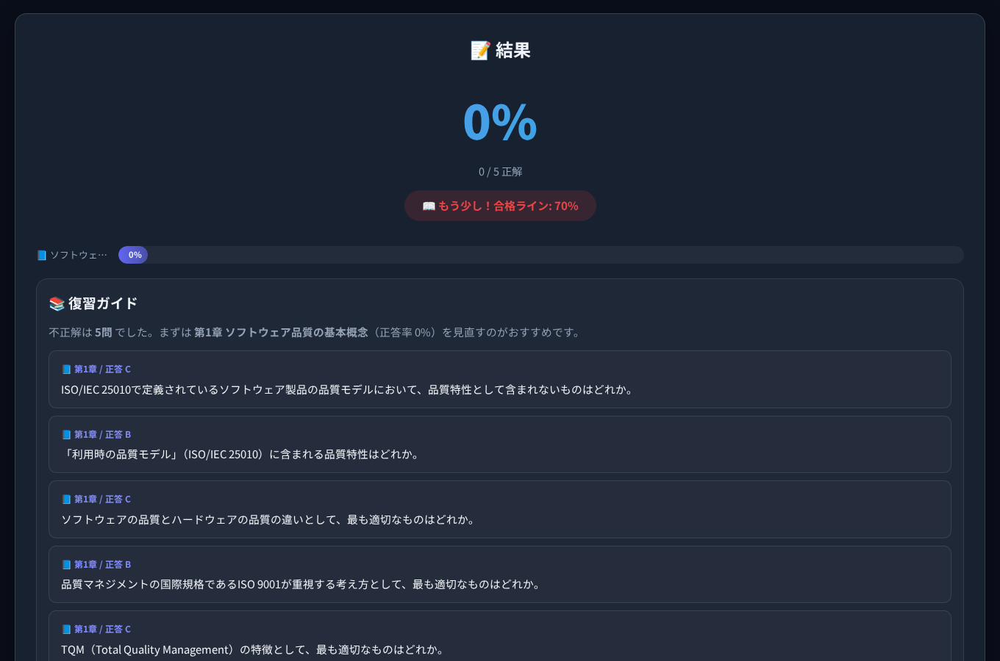
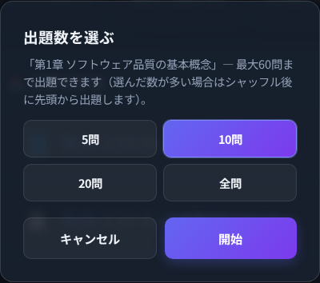

# 画面仕様書（Screen Specification）

> **読者**: 実装者・デザイン差分の確認・受け入れテストのたたき台  
> **関連**: [03_features.md](./03_features.md)（機能ルール） / [04_ui_design.md](./04_ui_design.md)（トークン・レイヤー） / [02_data_model.md](./02_data_model.md)（永続データ）

本書は **画面上の構成・操作・遷移** を中心にまとめる。ビジネスルールの詳細は `03`、色・z-index・コンポーネントの原則は `04` を参照する。

**キャプチャ**は `docs/images/screen-spec/` にあり、`npm run screenshots:screen-spec` で再生成できる（ダミー `localStorage` 使用）。

---

## 1. 画面マップと遷移

| 画面 ID | DOM | 種別 | 説明 |
|---------|-----|------|------|
| `tab-home` | `#tab-home` | タブ | 学習の起点。メニュー・分野別・計画ジェネレータ |
| `tab-glossary` | `#tab-glossary` | タブ | 用語一覧 / フラッシュカード切替 |
| `tab-stats` | `#tab-stats` | タブ | ダッシュボード・バッジ・弱点 |
| `tab-settings` | `#tab-settings` | タブ | Firebase・テーマ・バックアップ |
| `quiz` | `#quiz` | フルスクリーン | 出題・解答・解説（モードによりタイマー） |
| `result` | `#result` | フルスクリーン | スコア・章別・復習リスト |
| `question-count-modal` | `#question-count-modal` | モーダル | 出題数 5/10/20/全問（分野別・弱点等） |

ナビは `nav.app-nav`（デスクトップではサイドバー）。`#quiz` / `#result` は `body` 直下にあり、`.app` の外で **z-index がナビより上**になる（[#49](https://github.com/junichi-muraoka/jcsqe-study-app/issues/49)）。

---

## 2. 学習モードと `state.mode`

`app.js` 内の `window.JCSQE.state`（`js/state.js`）の `mode` と UI の対応。

| `state.mode` | 起動例 | 出題数 | タイマー | 解説表示 |
|--------------|--------|--------|----------|----------|
| `daily` | `startDailyChallenge()` | 5問固定 | なし | あり（模試以外） |
| `chapter` | 章クリック → モーダル確定 | 選択 | なし | あり |
| `weak` | 弱点克服 → モーダル | 弱点プール内 | なし | あり |
| `spaced` | 間隔反復 → モーダル | 同上 | なし | あり |
| `bookmark` | ブックマーク復習 | 登録分 | なし | あり |
| `mock` | 模擬試験（確認ダイアログ） | 40問 | **60分** | **なし**（即次へ） |
| `retryWrong` | 結果の「間違えた問題を復習」 | 可変 | なし | あり |

---

## 3. 画面別仕様

### 3.1 ホーム（`#tab-home`）

| 領域 | 主な要素 | 操作・挙動 |
|------|----------|------------|
| ヒーロー | `.hero-title` / `#home-stats` | `updateHomeStats()` で解答数・正答率・弱点数・合格予測 |
| 試験情報 | `#exam-info` | 試験日・カウントダウン（`exam_meta` 系データ） |
| 学習計画 | `#plan-result` | `generateStudyPlan()` |
| メニュー | `[data-testid=nav-daily]` 等 | 各 `start*` がクイズへ。模試は `confirm()` |
| 分野別 | `#chapter-list` | 各章 `startChapterMode(chId)` → **出題数モーダル** |

---

### 3.2 成績（`#tab-stats`）

| 領域 | 主な ID | データソース |
|------|---------|----------------|
| サマリ | `#dash-total` 等 | `loadData()` の集計 |
| リング | `#dash-rings` | `chapterStats` |
| バッジ | `#dash-badges` | 固定条件配列（`app.js` 内） |
| ヒートマップ | `#dash-heatmap` | `dailyActivity` + `getLocalDateKey` |
| 弱点 | `#dash-weak-list` | `weakIds` × `QUESTIONS` |

---

### 3.3 用語集（`#tab-glossary`）

　

| 要素 | 説明 |
|------|------|
| `#glossary-search` | `filterGlossary()` |
| `#glossary-mode-btn` | `toggleGlossaryMode()` — 一覧 / フラッシュカード |
| `#glossary-list` / `#glossary-flashcard` | 表示切替（`hidden` トグル） |

---

### 3.4 設定（`#tab-settings`）

| カード | 内容 |
|--------|------|
| `#firebase-auth-card` | 未設定時はプレースホルダメッセージ。設定済みなら `firebase-sync.js` がログイン UI を制御 |
| テーマ | `#theme-toggle-btn` → `toggleTheme()` |
| データ | `exportData` / `importData` / `resetData` |

---

### 3.5 クイズ（`#quiz`）

　

| 要素 | 説明 |
|------|------|
| `#quiz-progress` / `#quiz-bar` | 現在 / 全問 |
| `#quiz-level` | `L1` / `L2` / `L3` |
| `#quiz-question` | 問題文 |
| `#quiz-choices` | `.choice-btn` ×4、`selectAnswer` |
| `#quiz-explanation` | 模試以外: 正誤後に表示。`choiceDetails` があれば肢別ブロック |
| `#quiz-timer-box` | 模試時のみ表示、`#quiz-timer` |
| 「やめる」 | `switchTab('tab-home')` |

---

### 3.6 結果（`#result`）

| 要素 | 説明 |
|------|------|
| `#result-score` / `#result-detail` | 正答率・内訳 |
| `#result-pass` | 70% 基準のメッセージ |
| `#result-chapter-stats` | セッション内の章別正答率 |
| `#result-wrong-list` | `
` で不正解の解説 |
| `#result-retry-wrong-btn` | 不正解があれば表示 → `startRetryWrongMode` |
| 模試 | `mockHistory` へ `push`（最大20件） |

---

### 3.7 出題数モーダル（`#question-count-modal`）

| 要素 | 説明 |
|------|------|
| `#qcount-modal-title` / `#qcount-modal-sub` | `openQuestionCountModal(opts)` で設定 |
| `.qcount-chip` | `data-qcount`: 5 / 10 / 20 / all |
| 確定 | `confirmQuestionCountModal()` → `onConfirm(limit)` |

分野別・弱点・間隔反復など、プール上限に応じて `maxCount` とデフォルト選択が変わる。

---

## 4. E2E・`data-testid` 索引

| `data-testid` | 用途 |
|-----------------|------|
| `nav-daily` | 今日の5問 |
| `nav-weak` | 弱点克服 |
| `nav-spaced` | 間隔反復 |
| `nav-mock` | 模擬試験 |

詳細は [tests/e2e.spec.js](../tests/e2e.spec.js)。

---

## 5. ログインゲート（省略）

Firebase が有効かつ未ログイン・スキップ未設定のとき `#login-gate` を表示（`js/firebase-sync.js`）。ローカルプレースホルダではキャプチャに含めない。挙動は [09_cloud_sync_firebase_spec.md](./09_cloud_sync_firebase_spec.md)。

---

## 6. メンテナンス

| 作業 | 方法 |
|------|------|
| キャプチャ更新 | `npm run screenshots:screen-spec` |
| README 用（重複するが別解像度・構図可） | `npm run screenshots:readme` |
| シード変更 | `scripts/lib/demo-study-seed.mjs` を編集（README / screen-spec 共通） |

画面追加時は **本書にセクション 1 ブロック＋ PNG 1 枚** を PR に含めると追跡しやすい。
